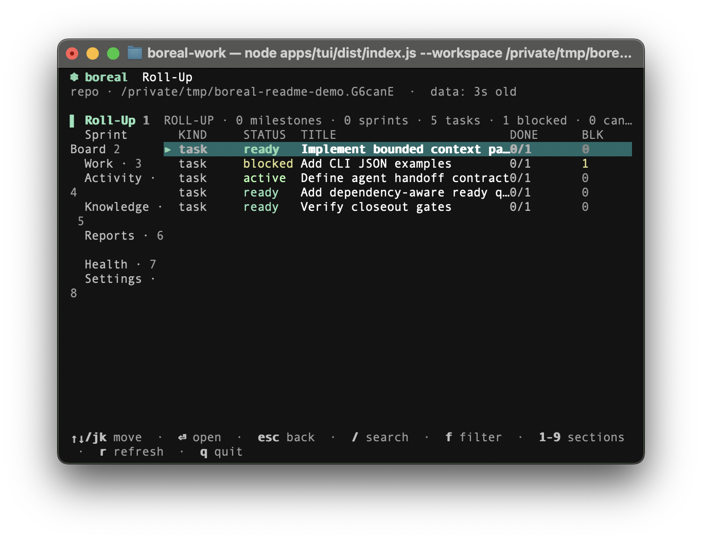

# Boreal Work

Boreal Work is a local CLI for keeping project context and work state in the repository. It is useful when work moves between people, coding agents, and sessions.

[Quick start](#quick-start) · [Contributing](CONTRIBUTING.md) · [First work loop](#your-first-work-loop) · [Agent manual](AGENT_README.md) · [CLI reference](docs/cli/COMMANDS.md) · [Documentation](docs/README.md)

> [!NOTE]
> **Early release:** Boreal is at `0.1.0`. The interfaces may change before 1.0. See the [compatibility policy](docs/architecture/COMPATIBILITY_POLICY.md) for the current expectations. The project is source-available under the [PolyForm Noncommercial License 1.0.0](https://polyformproject.org/licenses/noncommercial/1.0.0).

## What it does

Projects spread their context across chats, tickets, documents, branches, and agent sessions. Boreal puts the parts that need to survive there into the project itself.

It records:

- work items, acceptance criteria, and dependencies;
- reservations, so two people or agents do not take the same work;
- sources, claims, and decisions behind the work;
- evidence and verification results; and
- handoffs for the next person or agent.

Boreal runs in the project and does not require a hosted service. You still use Git hosting, code review, a ticketing system, and a coding agent. Boreal gives them a common place to read and update project state.

## How it works

The usual path looks like this:

~~~mermaid
flowchart LR
    A["Request, chat, docs, code"] --> B["Capture context"]
    B --> C["Plan scenarios + acceptance"]
    C --> D["Build dependency graph"]
    D --> E["Claim one safe lane"]
    E --> F["Execute + checkpoint"]
    F --> G["Verify with evidence"]
    G --> H["Reconcile, hand off, or close"]
    H -. "new context" .-> B
~~~

Start with a request, break it into work, claim a lane, run the checks, and leave enough context for someone else to continue. Dependencies decide what is ready, and closeout can require evidence before work is marked complete.

The same project state is available through the CLI, MCP server, console, TUI, and daemon.

### Screenshot

This is the terminal dashboard using demo data. It reads the same work and reservation records as the CLI.

  

Terminal dashboard showing ready, blocked, and active work.

## Scope

Boreal works for a single repository and a single operator, but the same records also support multiple agents, worktrees, and stricter review or audit requirements. The [product contract](docs/product/PRODUCT_CONTRACT.md) describes those profiles in detail.

## Quick start

For the released CLI, you need Git, Node.js 22 or newer, and pnpm or Corepack. If you are working on Boreal itself, start with the [contributor guide](CONTRIBUTING.md).

### 1. Install the machine CLI

~~~bash
curl -fsSL https://raw.githubusercontent.com/mattrichmo/boreal-work/main/install.sh \
  | bash -s -- --machine --yes

bwrk --version
~~~

### 2. Set up a project

~~~bash
cd your-project
bwrk setup --yes
bwrk agent guide
~~~

<code>bwrk setup</code> initializes the current repository. It creates the `.boreal/` state directory, the memory vault, Git guards, and project-level agent skills. Installing the CLI and setting up a project are separate steps.

After setup, `.boreal/` holds project state, `memory/` holds the project notes and handoffs, and `.agents/skills/` holds the agent guidance. `bwrk agent guide` prints the instructions for this project.

The generated guide covers workspace binding, read-only inspection, JSON IDs, safe claiming, evidence, closeout, recovery, and handoff. The full protocol is in the [agent manual](AGENT_README.md).

To make an integration available in every repository on this machine:

~~~bash
bwrk integrations add codex --scope user
bwrk integrations add claude --scope user
~~~

Use the default <code>--scope project</code> when an integration belongs to only one repository. See [project setup](docs/architecture/PROJECT_SETUP.md) for alternate memory layouts and Git modes.

<strong>Install and update details</strong>

For a source checkout, build and install the local CLI:

~~~bash
pnpm install
pnpm build
./install.sh --machine --yes
~~~

For an already-installed machine CLI, <code>bwrk upgrade --machine</code> fetches and builds the configured upstream Git ref. The advanced equivalents are <code>bwrk update self</code> and <code>bwrk update repo</code>. None of these commands package the current working tree.

Preview project setup before writing:

~~~bash
bwrk setup --dry-run
~~~

## Contributing

Bug reports, documentation fixes, design discussion, and code changes are welcome within the project license. The [contributor guide](CONTRIBUTING.md) has the local setup and checks.

## Your first work loop

Here is a small example using an already-scoped work item. For a larger feature, capture the relevant sources, split the request into scenarios and acceptance criteria, and add dependencies first. The [agent control loop](AGENT_README.md#the-agent-control-loop) has the full procedure.

The basic flow is: create the work, claim it, record the check, then close it with a handoff.

### 1. Create work

~~~bash
bwrk work create "Add request tracing" \
  --description "Attach a trace ID to each request and structured log line" \
  --acceptance "Trace IDs appear in server logs" \
  --ready
~~~

<code>bwrk</code> prints a work ID such as <code>bw_work_...</code>. Use that ID in the commands below.

### 2. Claim it

~~~bash
bwrk work claim <work-id> \
  --agent agent-api \
  --purpose "implement request tracing" \
  --ttl 2h
~~~

The claim checks blockers and reserves the work in one operation. It also returns the current context for the agent. The reservation expires unless it is renewed, and other actors can see who owns the work and when that ownership ends.

### 3. Record proof

Run the project's check, then attach the result to the work item:

~~~bash
pnpm test

bwrk evidence add <work-id> \
  --summary "pnpm test passed" \
  --kind test \
  --outcome passed \
  --command "pnpm test"
~~~

The result is attached to the work item, so a later agent or reviewer does not have to search through terminal history.

### 4. Close and hand off

Use the evidence ID returned by the previous command:

~~~bash
bwrk agent finish <work-id> \
  --agent agent-api \
  --evidence <evidence-id> \
  --verdict passed \
  --close \
  --reason "acceptance criteria verified" \
  --commit <full-commit-sha>
~~~

The work now has its proof, verification result, checkpoint, and handoff. Dependent work can be updated from that state.

> [!IMPORTANT]
> The <code>--command</code> on <code>evidence add</code> records what you report; it does not execute the command. For Boreal-witnessed execution, use [declared gates](#require-boreal-witnessed-evidence).

The simplified state flow is:

~~~mermaid
stateDiagram-v2
    [*] --> Ready
    Ready --> InProgress: atomic claim
    Ready --> Blocked: open dependency
    Blocked --> Ready: blocker resolves
    InProgress --> NeedsVerification: evidence submitted
    NeedsVerification --> Verified: verification passes
    NeedsVerification --> InProgress: verification fails
    Verified --> Closed: closeout gates pass
    InProgress --> Ready: release or expiry
    Closed --> [*]
~~~

<strong>What <code>agent finish</code> does</strong>

<code>agent finish</code>:

1. validates reservation ownership and expiration;
2. records or reuses evidence against the work;
3. creates a verification record;
4. evaluates required closeout gates;
5. writes the closeout summary and Git checkpoint;
6. closes the work and releases its reservation; and
7. recomputes dependent readiness.

## The records

You can use Boreal without knowing how it stores files. These are the main records:

| Record | Meaning | Use |
| --- | --- | --- |
| **Work structure** | A request split into scenarios, dependencies, and acceptance criteria. | Plan before changing code. |
| **Work** | A task with an expected result. | Track what needs to happen. |
| **Dependency** | A relationship where one item blocks another. | Keep blocked work out of the ready list. |
| **Reservation** | A time-limited claim by a person or agent. | Avoid duplicate ownership. |
| **Source / claim / decision** | The reference, statement, and choice behind a task. | Keep the reason for the work. |
| **Evidence / verification** | A reported result and the check against the acceptance criteria. | Support a closeout. |
| **Memory vault** | Pages, raw inputs, ledgers, and handoffs. | Keep project knowledge readable and versioned. |

These files have different roles:

- **Records** are the source of truth.
- **Views and indexes** can be rebuilt.
- **Git** versions the files and checkpoints.

## Machine-readable output

Humans can use the normal output. Scripts and CI should add <code>--json</code> when they need to make a decision from the result:

<strong>Show JSON output</strong>

~~~bash
bwrk work list
bwrk work list --json
bwrk commands --json
~~~

State-changing commands return a result block like this:

~~~json
{
  "ok": true,
  "data": {
    "result": {
      "schemaVersion": "boreal.cli.result.v1",
      "id": "bw_work_...",
      "kind": "work",
      "status": "ready"
    }
  }
}
~~~

Use the returned ID instead of parsing the human output. For the exact commands supported by the installed version, use:

~~~bash
bwrk --help
bwrk help work
bwrk commands --format markdown
bwrk commands --json
bwrk version --json
~~~

See the [complete CLI command reference](docs/cli/COMMANDS.md) for flags, behavior, error cases, and JSON envelopes.

## More examples

These examples cover dependencies, parallel work, project knowledge, search, and witnessed evidence. They are optional; the [CLI reference](docs/cli/COMMANDS.md) is the complete command list.

### Dependencies

<strong>Show dependency graph commands</strong>

Create two tasks, then make documentation wait for implementation:

~~~bash
bwrk work create "Add tracing middleware" --priority high --ready
bwrk work create "Document trace headers" --priority normal --ready

bwrk dep add <docs-work-id> <middleware-work-id> --json
bwrk dep tree <docs-work-id> --json
bwrk work next --json
~~~

Before the dependency, both tasks can be ready. After it is added, the documentation task becomes <code>blocked</code>; when the middleware task closes, it becomes ready again.

~~~mermaid
flowchart LR
    Middleware["Add tracing middleware"] -->|"blocks"| Docs["Document trace headers"]
~~~

Check the graph for cycles:

~~~bash
bwrk dep cycles --json
bwrk doctor --strict --json
~~~

### Parallel work

<strong>Show parallel-agent commands</strong>

Find claimable work without mutating state, then give exact items to separate agents:

~~~bash
bwrk work parallel \
  --label backend \
  --agent agent-a \
  --agent agent-b \
  --limit 2 \
  --json

bwrk agent start <work-id-a> --agent agent-a --worktree --ttl 90m --json
bwrk agent start <work-id-b> --agent agent-b --worktree --ttl 90m --json

bwrk reservation list --status active --json
bwrk agent renew --all --agent agent-a --extend 30m --json
~~~

Reservations are leases, not a separate work phase. When one expires or is released, the work can become ready again. Selection and reservation happen in one locked transaction, so a stale list cannot result in two claims.

See [lane worktree isolation](docs/architecture/LANE_WORKTREE_ISOLATION.md) for branch naming, worktree cleanup, and the full contract.

### Project knowledge

<strong>Show knowledge-capture commands</strong>

Capture the reason for a task as structured knowledge:

~~~bash
bwrk source add \
  --title "Tracing design note" \
  --uri "docs/tracing.md" \
  --kind document \
  --summary "Defines trace propagation and logging fields"

bwrk claim create \
  --statement "Every inbound request must receive a trace ID" \
  --status accepted \
  --source <source-id>

bwrk decision create \
  --title "Use W3C trace context" \
  --decision "Adopt traceparent for inbound and outbound propagation" \
  --context "Interoperability with existing tooling" \
  --source <source-id>

bwrk work create "Add trace propagation" \
  --source <source-id> \
  --acceptance "Outbound requests preserve traceparent" \
  --ready
~~~

For raw material that still needs interpretation, capture first and reconcile later:

~~~bash
bwrk raw add \
  --title "Tracing incident transcript" \
  --kind chat \
  --tag observability

bwrk wiki create "Request tracing" \
  --source <raw-id> \
  --tag architecture

bwrk wiki show request-tracing --json
~~~

### Context and search

<strong>Show context and search commands</strong>

Claims return a bounded handoff containing the work view, reservation, context pack, freshness metadata, and focused search results. You can request the same information directly:

~~~bash
bwrk context show <work-id> --json
bwrk context search "request tracing" --limit 10 --explain --json
bwrk search query "traceparent logs" --limit 10 --json
~~~

Search repairs a missing or stale local index by default. Use <code>--no-rebuild</code> when automation should fail closed:

~~~bash
bwrk search query "traceparent" --no-rebuild --json
bwrk search index --json
~~~

### Witnessed evidence

<strong>Show witnessed-evidence commands</strong>

When a gate must prove that Boreal observed the command and its outputs, declare the command on the work item and run the gate through Boreal’s bounded runner:

~~~bash
bwrk work create "Harden the parser" \
  --acceptance "The parser suite passes" \
  --required-gate verification \
  --gate-command "pnpm test parser" \
  --gate-expect "tests pass" \
  --gate-trust boreal_witnessed \
  --gate-current-revision \
  --gate-current-git \
  --ready

bwrk evidence run <work-id> --gate verification --dry-run --json
bwrk evidence run <work-id> --gate verification --json
~~~

The runner only executes the command declared on the gate. It records the command, exit state, bounded output, hashes, tool versions, revision, and Git state. A failed or timed-out run remains visible but cannot satisfy a passing gate.

See [evidence trust](docs/architecture/EVIDENCE_TRUST.md) for the difference between self-reported, Boreal-witnessed, and externally attested evidence.

## Runtime details

The CLI, MCP server, console, TUI, and daemon all use the same engine and storage. A change made through one surface is handled the same way as a change made through another.

The main pieces are:

~~~mermaid
flowchart TB
    subgraph surfaces["Interfaces"]
        cli["bwrk CLI"]
        mcp["MCP server"]
        console["Browser console / TUI"]
        daemon["Daemon"]
    end
    engine["Shared Boreal engine"]
    operational["Canonical operational records .boreal/objects + .boreal/log"]
    memory["Human-readable memory vault memory/"]
    views["Rebuildable views context packs, indexes, ledgers"]

    surfaces --> engine
    engine --> operational
    engine --> memory
    operational --> views
~~~

The important rules are:

| Rule | Behavior |
| --- | --- |
| **Readiness follows dependencies** | Blocked work does not appear in the ready list. |
| **Claims are atomic** | Finding and reserving work happen in one locked operation. |
| **Closeout can require evidence** | Verification, checkpoints, reviews, and audits stay separate. |
| **Evidence shows its source** | Reported, witnessed, and external evidence are distinguishable. |
| **Project boundaries are enforced** | Workspace, memory, Git, worktree, and path lookups cannot silently cross projects. |
| **Generated state can be repaired** | Rebuild and repair commands report what they changed. |

For the full contracts, see [runtime architecture](docs/architecture/RUNTIME.md), [closeout gates](docs/architecture/CLOSEOUT_GATE_CONTRACT.md), and [long-running tasks](docs/architecture/LONG_RUNNING_TASKS.md).

## Sync, health, and recovery

These commands are for stale indexes, interrupted work, and other project-state problems.

<strong>Show recovery commands and behavior</strong>

Use these commands to inspect or repair project health:

~~~bash
bwrk sync refresh --strict --json
bwrk doctor --strict --json
bwrk doctor --fix --json
~~~

<code>sync refresh</code> rebuilds context projections, search indexes, project rollups, and JSONL ledgers. <code>doctor</code> checks schema and references, dependencies, reservations, gates, readiness, source and wiki coverage, Git guards, index freshness, ledger drift, and stale locks.

<code>doctor --fix</code> is limited to idempotent repairs such as expiring stale reservations, recomputing readiness, rebuilding projections and indexes, restoring ignore guards, and removing stale locks. It does not silently remove tracked files or rewrite canonical meaning.

For portable state and recovery baselines:

~~~bash
bwrk export json --out boreal-export.json --json
bwrk export ledgers --out .boreal/ledgers --json
bwrk snapshot create --name before-migration --json
bwrk ledger status --json
~~~

## Project layout

Setup creates three directories with different jobs:

- `.boreal/` stores machine-readable operational records, locks, and rebuildable projections.
- `memory/` stores human-readable project knowledge, raw inputs, ledgers, and handoffs.
- `.agents/skills/` stores project-scoped instructions that connect an agent client to the project workflows.

<strong>Directory layout</strong>

~~~text
your-project/
├── .boreal/
│   ├── project.json       project and storage configuration
│   ├── objects/           canonical per-record JSON objects
│   ├── log/               append-only events and local operations
│   ├── ledgers/           generated Git-friendly JSONL exports
│   ├── cache/             disposable SQLite indexes
│   ├── runtime/           locks and compatibility projections
│   └── results/           local spooled command results
├── .agents/skills/        installed agent adapters
└── memory/                human-readable project vault
~~~

By default, <code>memory/</code> is a child repository with separate Git history. Project skills are installed at <code>.agents/skills</code>. New workspaces use a Git-friendly per-record object store (<code>ObjectDirBorealStore</code>). The legacy file store remains available for compatibility and rollback. See [runtime architecture](docs/architecture/RUNTIME.md) for storage boundaries, event history, locks, and migrations.

## Interfaces

The interfaces all read and write the same project state:

| Interface | Best for |
| --- | --- |
| <code>bwrk</code> CLI | Run commands, scripts, and automation. |
| MCP server | Let a local agent work with a selected project. |
| Daemon | Watch project and coordination status. |
| Browser console | Browse local project and cross-project dashboards. |
| **TUI** | Use the terminal dashboard. |

See [MCP server](docs/architecture/MCP_SERVER.md), [daemon](docs/architecture/DAEMON.md), [console app](docs/architecture/CONSOLE_APP.md), and [TUI contracts](docs/architecture/TUI_SURFACE_CONTRACTS.md).

## Documentation map

| Read this | When you need… |
| --- | --- |
| [Getting started](docs/getting-started.md) | A slower installation walkthrough and first work loop. |
| [Agent manual](AGENT_README.md) | Explicit agent protocol, JSON extraction rules, workflows, gates, checkpoints, and recovery procedures. |
| [Core concepts](docs/concepts.md) | The deeper mental model for work, evidence, knowledge, context, memory, and agents. |
| [CLI commands](docs/cli/COMMANDS.md) | Complete syntax, flags, JSON behavior, and error cases. |
| [Product contract](docs/product/PRODUCT_CONTRACT.md) | Product jobs, invariants, capability profiles, and non-goals. |
| [Runtime architecture](docs/architecture/RUNTIME.md) | Engine, storage, locks, migrations, and interface boundaries. |
| [Evidence trust](docs/architecture/EVIDENCE_TRUST.md) | Provenance, revisions, hashes, and verification behavior. |
| [Closeout gates](docs/architecture/CLOSEOUT_GATE_CONTRACT.md) | Verification, checkpoint, review, and audit policy. |
| [Project setup](docs/architecture/PROJECT_SETUP.md) | Memory layouts, Git modes, install roots, and workspace boundaries. |
| [Long-running tasks](docs/architecture/LONG_RUNNING_TASKS.md) | Durable runs, checkpoints, waits, retries, workers, and event cursors. |
| [Skills and workflows](docs/architecture/SKILLS_AND_WORKFLOWS.md) | Canonical procedures and agent-facing adapters. |
| [Schemas](schemas/README.md) | Published persisted record shapes. |
| [Documentation index](docs/README.md) | The full map of maintained guides and architecture notes. |

## License

Boreal Work is source-available under the [PolyForm Noncommercial License 1.0.0](https://polyformproject.org/licenses/noncommercial/1.0.0). You may use, modify, and redistribute the software for noncommercial purposes. Commercial use requires separate written permission from the copyright holder.
