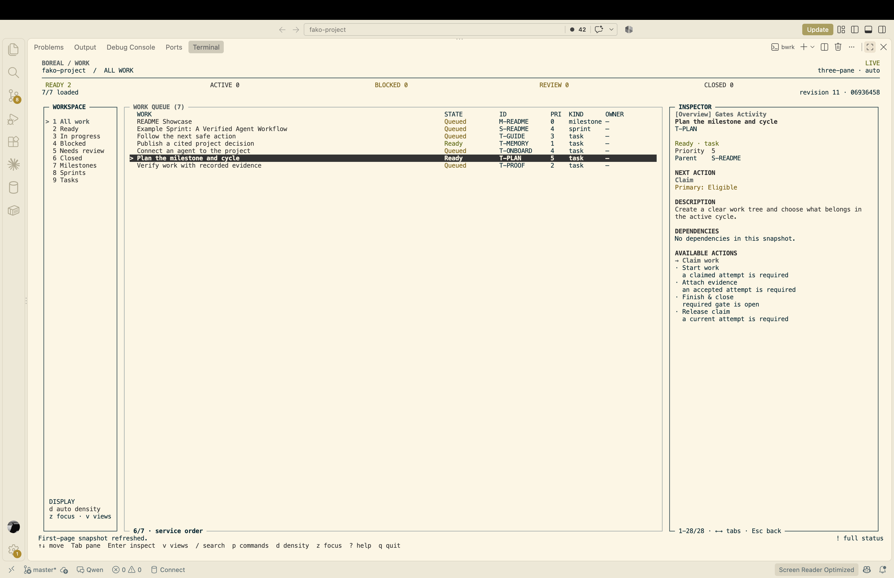

<div align="center" id="readme-top">
  

  <h1>Boreal Work</h1>

  <p><strong>The local operating system for project work shared by people and agents.</strong></p>
  <p>Plan it. Coordinate it. Prove it. Carry its knowledge forward.</p>

  <p>
    <a href="#what-is-boreal">What is Boreal?</a> ·
    <a href="#parallel-agents-and-subagents">Parallel agents</a> ·
    <a href="#quick-start">Quick start</a> ·
    <a href="#command-line-workflows">CLI</a> ·
    <a href="#documentation">Documentation</a>
  </p>
</div>

## What is Boreal?

Boreal gives a project a durable memory, a live model of its work, and a governed path from an early idea to an accepted outcome. It brings plans, source material, decisions, active work, evidence, and learned context into one project record that can survive every handoff and agent session.

A Boreal project can be software delivery, research, operations, writing, product development, or any other sustained effort with multiple steps and participants. People and agents work from the same current state: what matters now, what is ready to move, who owns it, what context shaped it, and what must be true before it is finished.

> **What are we trying to accomplish? What can move now? Who or what is responsible? Which sources and decisions shaped the work? What proves the result? What should the next session remember?**

<p align="center">
  
</p>
<p align="center"><em>The live Boreal terminal dashboard, populated with fictional project data.</em></p>

> [!IMPORTANT]
> Boreal v2 is under active development. Working slices exist across the project model, store, local service, CLI, terminal dashboard, sources, and memory. The complete installed journey—from onboarding and claiming work through result binding, evidence, review, closeout, and recovery—still requires final integrated qualification. See the [production-completion plan](project/build-plan/production-completion/FINAL_PRODUCTION_PLAN.md) for the current finish line.

## One continuous project loop

Project work rarely begins as a tidy task and rarely ends when someone marks a box complete. Boreal keeps the whole path connected:

**Capture** → **Plan** → **Schedule** → **Execute** → **Verify** → **Review** → **Remember**

| Stage | What Boreal keeps with the project |
| --- | --- |
| **Capture** | Notes, discoveries, questions, revisit reminders, and source material before their final meaning is known. |
| **Plan** | Outcomes, milestone and task trees, dependencies, priorities, and acceptance requirements. |
| **Schedule** | Cycles and assignments that say when work is intended to happen without changing where it belongs in the work tree. |
| **Execute** | Eligible next actions, scoped ownership, active attempts, progress, handoffs, and interruption recovery. |
| **Verify** | The exact result under review, structured evidence, required checks, and the facts still preventing acceptance. |
| **Review** | Independent decisions where policy requires them, followed by an explicit accepted closeout. |
| **Remember** | Versioned sources, citations, decisions, summaries, and curated project memory that later work can retrieve. |

The result is continuity. A new person or agent can enter the project without reconstructing its history from scattered chats, private notes, or the memory of whoever worked on it last.

## One project, many participants

People continue to use the tools that suit their work. Codex, Claude, and other supported harnesses remain responsible for running their agents. Boreal provides the shared project authority around them:

- Operators shape the plan, scheduling scope, acceptance rules, and exceptions.
- People and agents discover eligible work and claim one bounded attempt at a time.
- The project records ownership, progress, deadlines, checkpoints, and handoffs.
- Verifiers and reviewers inspect the result and evidence tied to that exact attempt.
- Future participants recover cited context and accepted project knowledge.

Every interface—CLI, terminal dashboard, or agent workflow—reads from the same versioned project state. Boreal derives readiness and the next safe action from the work graph, current ownership, policy, proof, and time instead of trusting a status label or a completion claim.

## Parallel agents and subagents

Boreal turns a project plan into safe parallel work. A human or coordinating agent decomposes an outcome into bounded tasks and dependencies. Codex, Claude, or another harness creates the agents and subagents. Each worker then uses Boreal to discover, claim, execute, and close one eligible piece of work.

```text
                       ┌─ subagent A → claim TASK-A → work → prove ─┐
project plan → ready ──┼─ subagent B → claim TASK-B → work → prove ─┼→ accepted outcomes
                       └─ subagent C → waits for A and B ────────────┘
```

Parallelism comes from the work graph. Independent tasks can be claimed and executed at the same time. Dependencies keep downstream work queued until the required outcomes are accepted. If two agents race for the same task, the claim is atomic: one receives the current fenced attempt and the other receives a conflict instead of creating duplicate ownership.

A typical agent or subagent loop is:

1. Ask Boreal for the next eligible action with `bwrk next` or the fuller `bwrk agent guide` response.
2. Give each concurrent worker its own session ID, then start the selected work with `bwrk agent start`, which resumes that session's current attempt or atomically claims eligible work.
3. Use the attempt ID and fence returned by Boreal for checkpoints, heartbeat, lease renewal, evidence, finish, or release.
4. Close through the required proof and review path. Accepted closeout advances dependencies and exposes newly ready work.
5. Resume interrupted work from the recorded session and handoff context instead of relying on the previous conversation.

The explicit claim command is `bwrk work claim`. `bwrk agent start` is the higher-level claim-or-resume entry point used by the guided agent flow. Automatic agent spawning is outside the current local product boundary; the active harness creates its subagents while Boreal coordinates their authority and shared state.

```sh
# Ask for one safe action. The JSON response includes the bound command shape.
bwrk next --project PROJECT --json
bwrk agent guide --project PROJECT --json

# Start a named task, or omit TASK-A to select eligible work for this session.
bwrk agent start TASK-A --project PROJECT \
  --source-version SOURCE_VERSION \
  --config-identity CONFIG_IDENTITY \
  --session SESSION-A --json

# The lower-level explicit claim form.
bwrk work claim PROJECT TASK-A \
  --source-version SOURCE_VERSION \
  --config-identity CONFIG_IDENTITY \
  --session SESSION-A --lease-ttl 30m --time-limit 2h --json
```

## Built for work you can trust

- **Local by design.** Each project has its own local service, operational database, runtime boundary, sources, and memory binding.
- **Clear ownership.** Claims are scoped and fenced so stale work cannot silently replace a newer result.
- **Evidence before acceptance.** Required checks and reviews determine whether an outcome can close and unblock dependent work.
- **History that stays honest.** Failed evidence, interrupted attempts, rejected reviews, overrides, and recovery actions remain visible.
- **Guidance with context.** Boreal can tell a participant what is eligible, what is required next, and why work must wait.
- **Knowledge with provenance.** Curated memory retains citations and publication history rather than becoming an untraceable collection of notes.
- **Harness-neutral operation.** Different agent tools can participate without creating separate versions of project truth.

## Quick start

### Install or update

The release installer places the `bwrk` CLI and compiled terminal dashboard under `~/.local`. Running the same command again updates the installation without modifying project databases:

```sh
curl -fsSL https://raw.githubusercontent.com/mattrichmo/boreal-work/refs/heads/main/install.sh | sh
bwrk --version
```

The final `| sh` is required. The release installer currently supports macOS on Apple Silicon or Intel and Linux on x86-64. Add `~/.local/bin` to `PATH` if the installer reports that it is missing.

Source builds are explicit. From a checkout, install the current source and its compiled dashboard with:

```sh
./install.sh --from-source
```

Use `--prefix /absolute/path` to choose another installation prefix, `--no-dashboard` for a CLI-only install, or `bwrk update` after installing a release that includes the updater. See the [installation guide](docs/INSTALL.md) for pinned releases, verified archives, Homebrew status, platform details, and rollback behavior.

### Initialize a project

Run setup inside the project you want Boreal to manage:

```sh

cd /path/to/your/project
bwrk init
bwrk dashboard
```

You can also name the folder directly. Relative folders are resolved from the
current directory, and all project files and skills are installed inside that
folder:

```sh
bwrk init /path/to/your/project
```

Setup creates the local Boreal project binding and operational state, initializes the project's memory repository, and installs guidance for Codex, Claude, or both. Running `bwrk dashboard` opens the service-backed terminal interface; normal dashboard use does not require a separately managed server.

For non-interactive or repeatable setup:

```sh
bwrk init --agents codex,claude --yes
bwrk init --dry-run
```

Setup is safe to repeat after an update. Managed metadata and skills are reconciled while existing project memory is preserved.

## Command-line workflows

The CLI is discoverable from the installed binary:

```sh
bwrk commands
bwrk help agent
bwrk help work
bwrk commands --json
```

`bwrk commands` reports the commands available in the current build as well as named route gaps. Use `bwrk help PATH`, such as `bwrk help work claim`, for the exact syntax supported by that installation.

### Project and planning

| Goal | Command |
| --- | --- |
| Open the terminal dashboard | `bwrk dashboard [PROJECT]` |
| Read the project snapshot | `bwrk status PROJECT` |
| List or inspect work | `bwrk work list PROJECT` · `bwrk work show PROJECT WORK_ID` |
| Create work | `bwrk work create PROJECT WORK_ID TITLE --kind task --expected-revision N` |
| Edit planning fields | `bwrk work edit PROJECT WORK_ID … --expected-revision N` |
| Add a dependency | `bwrk dep add PROJECT PREREQUISITE_ID DEPENDENT_ID --expected-revision N` |
| Inspect the graph | `bwrk dep tree PROJECT` · `bwrk dep cycles PROJECT` |
| Inspect schedules | `bwrk cycle list --project PROJECT` · `bwrk cycle board --project PROJECT CYCLE_ID` |

### Agent execution

| Goal | Command |
| --- | --- |
| Discover the next action | `bwrk next --project PROJECT --json` |
| Explain the current action and obligations | `bwrk agent guide --project PROJECT [--work WORK_ID] --json` |
| Inspect one agent session | `bwrk agent status --project PROJECT --session SESSION_ID` |
| Register a harness session | `bwrk session start --project PROJECT --session SESSION_ID --harness HARNESS_ID` |
| Start or resume eligible work | `bwrk agent start [WORK_ID] --project PROJECT …` |
| Explicitly claim work | `bwrk work claim PROJECT WORK_ID --source-version ID --config-identity ID …` |
| Resume a recorded attempt | `bwrk agent resume --project PROJECT --session SESSION_ID --attempt ATTEMPT_ID` |
| Record progress | `bwrk work checkpoint --work ID --input PATH --expected-revision N --reason TEXT --yes` |
| Record liveness or renew the lease | `bwrk agent heartbeat …` · `bwrk agent renew …` |
| Release unfinished work | `bwrk agent release WORK_ID --project PROJECT --attempt ID --fence N` |
| Finish through proof-gated closeout | `bwrk agent finish WORK_ID --close --project PROJECT --attempt ID --fence N --receipt PATH --summary PATH` |

The claim response supplies the attempt ID, fence, lease deadline, and hard deadline. Heartbeat records liveness; renewal extends only the renewable lease. Every later mutation must use the current attempt and fence so a stopped or superseded agent cannot write as the owner.

### Sources, proof, review, and memory

| Goal | Command |
| --- | --- |
| Capture or inspect source material | `bwrk source add PROJECT --input PATH --origin ORIGIN` · `bwrk source list PROJECT` |
| Search or verify sources | `bwrk source search PROJECT QUERY` · `bwrk source verify PROJECT SOURCE_VERSION_ID` |
| Run or attach evidence | `bwrk evidence run --project PROJECT --work WORK_ID --gate GATE_ID` · `bwrk evidence add …` |
| Inspect review decisions | `bwrk review list --project PROJECT` · `bwrk review show --project PROJECT REVIEW_ID` |
| Record a review decision | `bwrk review approve …` · `bwrk review reject …` · `bwrk review return …` · `bwrk review revoke …` |
| Draft and publish cited memory | `bwrk memory draft …` · `bwrk memory review …` · `bwrk memory publish …` |
| Retrieve project memory | `bwrk memory search --project PROJECT QUERY` · `bwrk memory show --project PROJECT DRAFT_ID` |
| Inspect an uncertain operation | `bwrk operation show PROJECT OPERATION_ID` |
| Diagnose the local project | `bwrk doctor --project PROJECT` |

Commands that change reviewed, published, recovery, or policy state require revision-bound input and explicit confirmation flags. Read the current command's help rather than copying placeholders into a live project.

## How the product is organized

```text
people / agent harnesses / CLI / terminal dashboard
                         ↓
              versioned local service
                         ↓
        application workflow and domain rules
                         ↓
     project store · source bank · curated memory
```

The Rust application owns lifecycle decisions. The store owns transactions and revisions. The TypeScript dashboard uses the versioned service API and never reads the canonical project database directly. Published curated memory lives in Git with explicit publication and reconciliation state; live work and attempts remain in the transactional store.

| Area | Responsibility |
| --- | --- |
| `crates/domain` | Work records, status derivation, and domain invariants |
| `crates/application` | Authoritative use cases, guidance, and read models |
| `crates/store` | Persistence, transactions, revisions, and audit history |
| `crates/cli` | `bwrk` commands, setup, and service connection |
| `crates/protocol` and `crates/service` | Versioned local API and runtime coordination |
| `crates/source` and `crates/memory` | Immutable sources, citations, and curated knowledge |
| `apps/tui` | Service-backed terminal dashboard |
| `project/spec` | Versioned product, workflow, and behavior contracts |

## Documentation

- [Installation and updates](docs/INSTALL.md)
- [Packaged agent workflows](docs/WORKFLOWS.md)
- [Architecture and implementation packet](project/README.md)
- [Work, cycle, schedule, and intake model](project/spec/WORK_MODEL_V2.md)
- [Security boundary](docs/SECURITY.md)
- [Migration from the legacy workspace](docs/MIGRATION.md)
- [Build and validation guide](docs/BUILD.md)

## Contributing

This repository is the canonical Boreal v2 workspace. Start with the [project packet](project/README.md), [master plan](MASTER_PLAN.md), and [agent handoff](AGENT_HANDOFF.md) before implementing a new slice. The active build plans define ownership and write boundaries for coordinated work.

The v2 runtime does not import code from the archived legacy implementation. Historical data crosses into v2 only through the explicit migration boundary, with unsupported or ambiguous records retained as findings rather than silently treated as trusted current state.

<div align="right">

[Back to top](#readme-top)

</div>
