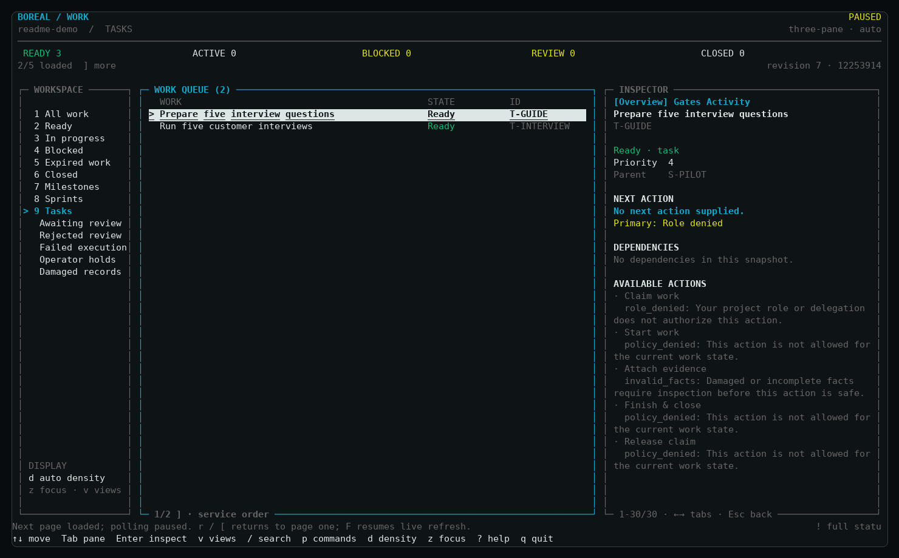
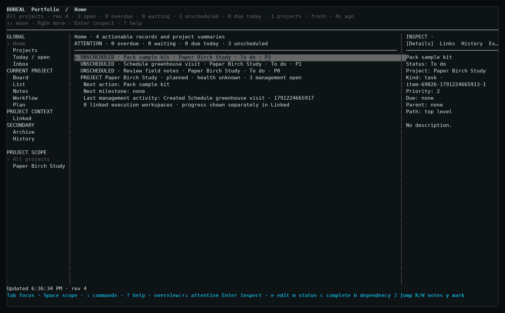

# Boreal Work

Boreal Work is a local-first project manager for people coordinating delivery
with AI agents. It pairs installation-wide oversight with project-local plans
and evidence-backed execution. A separate per-user global store can summarize
and link workspaces; it does not take over their execution records.



**Project dashboard.** Task queue and inspector for the synthetic `readme-demo` project. The local demo session is not authorized to claim work; no task action was attempted.



**Global dashboard.** Portfolio view with the synthetic “Paper Birch Study” project and its sample follow-ups.

<p><em>Both captures were recorded from the local PR #11 candidate at commit <code>351e18c</code> (tree <code>3f8ba75</code>), a pre-integration snapshot rather than the resulting <code>main</code> tree or a release. See the <a href="docs/README-CAPTURE-NOTES.md">capture provenance and reproduction notes</a>.</em></p>

## What Boreal is for

Boreal helps people plan project work, coordinate human and agent execution,
and keep a verifiable record of what was completed and why it is ready to
advance. It is useful when work needs explicit dependencies, bounded agent
attempts, source provenance, evidence, or review before dependent work can
proceed. The global manager adds a cross-project view and a separate place for
management projects, personal todos, and notes.

## How the records relate

| Record | Scope and relationship |
| --- | --- |
| Global management project | Lives in the per-user global store. It can hold personal work and notes and can be associated with a folder or linked to a Boreal workspace. A folder association alone does not initialize a workspace. |
| Milestone, sprint, and task | Live in one Boreal workspace. Milestones and sprints organize tasks; parent links organize the plan, while dependency links identify prerequisites and affect readiness. |
| Attempt, evidence, gate, and review | Belong to project execution. An attempt is scoped to a worker identity and session. Evidence and review decisions are recorded against work; project rules may require gates or review before work closes or unblocks dependents. |
| Source and curated memory | Source versions preserve provenance for project material. Curated notes are published separately in `memory/`, which uses Git by default; raw sources and live work remain in the project store. |

The project workspace is the authority for its task status, dependencies,
attempts, and evidence. The global manager can show linked-workspace progress,
but it does not own those records or decide whether linked work is claimable.

## A practical agent workflow

1. Initialize a workspace, then plan milestones, sprints, tasks, dependencies,
   and acceptance intent.
2. Ask Boreal for the current safe action with `bwrk agent guide --project
   PROJECT --json` or `bwrk next --project PROJECT --json`. These reads include
   current readiness and required steps; an empty project has no claimable
   tasks.
3. Claim or start one bounded attempt under the intended actor and session.
   Boreal records the attempt and fence so separate workers do not share an
   untracked claim.
4. Do the work, attach real evidence, and follow any verification or review
   requirements. Finish or release the attempt through the guided workflow;
   “done” text alone does not satisfy a required gate.
5. Use summaries, handoffs, and cited project knowledge to carry context
   forward. Publish curated memory when it is ready to be reused.

Packaged Codex and Claude skill adapters route agents through the same CLI and
application rules. They provide planning, routing, claim, review, finish, and
memory workflows; they do not replace the project state or grant authority.
See [CLI workflows](docs/CLI_WORKFLOWS.md), [agent orchestration](docs/CLI_ORCHESTRATION.md),
and [knowledge workflows](docs/CLI_KNOWLEDGE.md) for command detail.

## Build and try the current source

The current v2 source can be built as a CLI. This temporary example initializes
a fresh project, checks it, and asks for its current guidance:

```sh
git clone https://github.com/mattrichmo/boreal-work.git
cd boreal-work
cargo build --locked --release -p boreal-cli --bin bwrk

boreal_demo_dir="$(mktemp -d)"
export BOREAL_GLOBAL_ROOT="$boreal_demo_dir/global"
bwrk_bin="$PWD/target/release/bwrk"
"$bwrk_bin" init "$boreal_demo_dir/project" --project boreal-demo --agents codex,claude --yes
cd "$boreal_demo_dir/project"
"$bwrk_bin" doctor
"$bwrk_bin" agent guide --project boreal-demo --json
printf 'Demo directory: %s\n' "$boreal_demo_dir"
```

This is a source build of the CLI, not a complete dashboard installation. To
open a dashboard, build or install its compiled TUI files as well. Use
`bwrk commands` to see the routes in the binary you built and `bwrk help PATH`
for their syntax.

## Source, tests, and public releases

This README describes the v2 source on `main` (workspace version `0.2.1`),
which is under active development. Tests under `crates/*/tests` exercise
project setup, work discovery and lifecycle, evidence, and global-manager
behavior. `scripts/release/package-smoke.sh` rehearses a locally built package
and install in temporary directories. Those checks are distinct from full
product/release qualification, which is still in progress.

As of this source revision, the [GitHub Releases page](https://github.com/mattrichmo/boreal-work/releases)
identifies `v0.1.0` as its latest published release. Its `bwrk-upgrade.tar.gz`
asset predates the Rust v2 workspace. The v2 installer in this checkout looks
for a platform-specific `bwrk-v<version>-<target>.tar.gz` archive and matching
`SHA256SUMS`; there is no published `v0.2.1` package matching this source.
Use the source-build steps above for the current v2 CLI, and check the Releases
page before using any package-install command. A tag or passing source test is
not the same as a published release.

## Platforms and limits

- The v2 installer targets release archives for macOS on Apple Silicon or
  Intel and Linux on x86-64. Linux ARM64 and Windows have no supported release
  archive target in this source; builds from source on other hosts have not
  been qualified.
- The interactive dashboard requires Node.js 20 through 26 and the compiled
  TUI files. The CLI-only source build above does not include those files.
- The service and project database are local to one host. Boreal does not
  provide hosted accounts or cloud sync, and SQLite project files are not a
  multi-host shared database. Configured agent tools and evidence commands may
  use their own network access.
- Some design and build-plan documents describe work that is not yet shipped.
  The installed binary's `bwrk commands` registry is the authority for its
  available CLI routes.

## Further reading

- [Packaged workflows](docs/WORKFLOWS.md)
- [CLI operations](docs/CLI_OPERATIONS.md) · [orchestration](docs/CLI_ORCHESTRATION.md) · [knowledge](docs/CLI_KNOWLEDGE.md)
- [Architecture](docs/ARCHITECTURE.md) · [security boundaries](docs/SECURITY.md)
- [Build checks and their limits](docs/BUILD.md) · [release packaging](docs/PACKAGING.md)
- [Migration from the legacy workspace](docs/MIGRATION.md)
