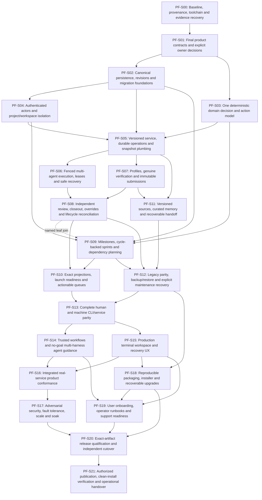

# Sprint and task dependency graph

Solid arrows are mandatory sprint-entry gates (`-T92`). Dotted arrows are extra joins on named leaves: early independent planning work may proceed, but its joined task and exit cannot pass early. The complete task graph is in `plan.json` and every task card. This is a DAG, not a calendar or a duration estimate.

## Explicit sprint dependencies

| Sprint | Entry gates | Additional leaf joins | Exit |
| --- | --- | --- | --- |
| [PF-S00](sprints/PF-S00/SPRINT.md) | None | None | PF-S00-T92 |
| [PF-S01](sprints/PF-S01/SPRINT.md) | PF-S00-T92 | None | PF-S01-T92 |
| [PF-S02](sprints/PF-S02/SPRINT.md) | PF-S01-T92 | None | PF-S02-T92 |
| [PF-S03](sprints/PF-S03/SPRINT.md) | PF-S01-T92 | None | PF-S03-T92 |
| [PF-S04](sprints/PF-S04/SPRINT.md) | PF-S02-T92 | None | PF-S04-T92 |
| [PF-S05](sprints/PF-S05/SPRINT.md) | PF-S02-T92, PF-S03-T92, PF-S04-T92 | None | PF-S05-T92 |
| [PF-S06](sprints/PF-S06/SPRINT.md) | PF-S05-T92 | None | PF-S06-T92 |
| [PF-S07](sprints/PF-S07/SPRINT.md) | PF-S05-T92 | None | PF-S07-T92 |
| [PF-S08](sprints/PF-S08/SPRINT.md) | PF-S06-T92, PF-S07-T92 | None | PF-S08-T92 |
| [PF-S09](sprints/PF-S09/SPRINT.md) | PF-S02-T92, PF-S03-T92, PF-S04-T92 | PF-S08 | PF-S09-T92 |
| [PF-S10](sprints/PF-S10/SPRINT.md) | PF-S08-T92, PF-S09-T92 | None | PF-S10-T92 |
| [PF-S11](sprints/PF-S11/SPRINT.md) | PF-S05-T92, PF-S07-T92 | None | PF-S11-T92 |
| [PF-S12](sprints/PF-S12/SPRINT.md) | PF-S08-T92, PF-S09-T92, PF-S11-T92 | None | PF-S12-T92 |
| [PF-S13](sprints/PF-S13/SPRINT.md) | PF-S10-T92, PF-S12-T92 | None | PF-S13-T92 |
| [PF-S14](sprints/PF-S14/SPRINT.md) | PF-S13-T92 | None | PF-S14-T92 |
| [PF-S15](sprints/PF-S15/SPRINT.md) | PF-S13-T92 | None | PF-S15-T92 |
| [PF-S16](sprints/PF-S16/SPRINT.md) | PF-S14-T92, PF-S15-T92 | None | PF-S16-T92 |
| [PF-S17](sprints/PF-S17/SPRINT.md) | PF-S16-T92 | None | PF-S17-T92 |
| [PF-S18](sprints/PF-S18/SPRINT.md) | PF-S15-T92, PF-S12-T92 | None | PF-S18-T92 |
| [PF-S19](sprints/PF-S19/SPRINT.md) | PF-S14-T92, PF-S15-T92, PF-S18-T92 | None | PF-S19-T92 |
| [PF-S20](sprints/PF-S20/SPRINT.md) | PF-S17-T92, PF-S18-T92, PF-S19-T92 | None | PF-S20-T92 |
| [PF-S21](sprints/PF-S21/SPRINT.md) | PF-S20-T92 | None | PF-S21-T92 |
